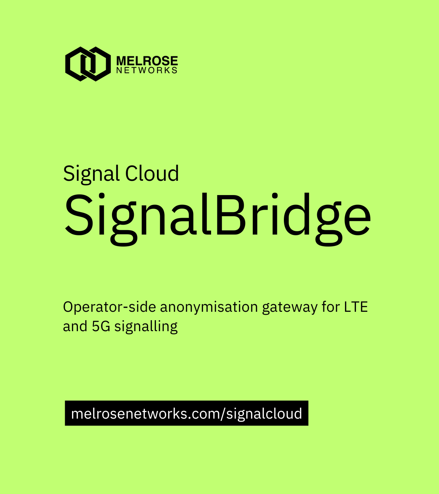

# SignalBridge

**SignalBridge** is the **operator-side gateway** component of the **[Signal Cloud](https://melrosenetworks.com/scloud)** platform from [Melrose Networks](https://melrosenetworks.com). It runs in the mobile-network environment, **decodes** LTE and 5G signalling (S1AP, NGAP, and related NAS), **filters** traffic to what you care about, **anonymises** subscriber identifiers where configured, and **streams structured events** onward—typically to Signal Cloud for storage and analysis—over TLS-capable HTTP(S) or other outputs you configure.

That split lets operators **analyse signalling at scale** while **keeping tight control** over real IMSIs and other sensitive identities at the edge.

**Further reading:** [Signal Cloud and SignalBridge](https://melrosenetworks.com/scloud) · [Melrose Networks on GitHub](https://github.com/melrosenetworks)

This open-source-style bundle supersedes the earlier [S1APAnonymise](https://github.com/melrosenetworks/S1APAnonymise) utility with a fuller pipeline (filtering, multiple I/O paths, metrics, optional cloud-oriented streaming) and adds support for 5G NGAP.

See [Melrose Networks Documentation Hub](https://docs.melrosenetworks.com) for further documentation.

## What’s in this repository

| Area | Role |
|------|------|
| **`signalbridge` binary** (build from source) | Main gateway: ingest PCAP/stream, decode, filter, anonymise, emit PCAP/TCP/UDP/HTTP(S). |
| **`config/*.yaml`** | Declarative inputs, outputs, filters, metrics bind address, and HTTP endpoint paths. |
| **`server/`** | Reference **SignalVault**-style HTTP ingest server for local testing of streaming output. |
| **`third_party/s1see/`** | Vendored LTE parser pieces so this tree builds **without** a separate S1-SEE checkout. |

Start with **Building** and **Running**, then open [`config/conduit.yaml`](config/conduit.yaml) and adjust inputs/outputs for your environment.

## How it fits your workflow

1. **Feed** live or recorded signalling (PCAP/PCAPNG file, TCP listener, or stdin).
2. **Tune** protocol/procedure/IP filters and anonymisation rules in YAML.
3. **Export** anonymised PCAP, binary streams, or **NDJSON-style batches** over HTTP(S) toward your analysis stack or Signal Cloud–compatible endpoints.
4. **Observe** health and throughput via **Prometheus** metrics (`/metrics` on the configured address).

## Capabilities

### Inputs

| Input | Status | Description |
|-------|--------|-------------|
| **File** | ✅ | PCAP or PCAPNG file via `-i capture.pcap` |
| **TCP listener** | ✅ | Listen on host:port for PCAP/PCAPNG stream (e.g. `tshark -w - \| socat -u STDIN TCP:localhost:50051`). Use `--loop` for multiple connections and config hot-reload. |
| **Stdin** | ✅ | Read PCAP/PCAPNG from stdin via `--stdin` |

### Outputs

| Output | Status | Description |
|--------|--------|-------------|
| **PCAP file** | ✅ | Write anonymised/filtered packets to file (`.pcap` or `.pcapng` by extension) |
| **TCP** | ✅ | Stream PCAP format to `tcp://host:port` |
| **UDP** | ✅ | Send each packet as a UDP datagram to `udp://host:port` (Wireshark Exported PDU format) |
| **HTTP/HTTPS streaming** | ✅ | Stream NDJSON batches (gzip); optional AES-256-GCM encryption |

### Processing

- **Decode** S1AP and NGAP (and related NAS) for structured handling downstream.
- **Anonymise** IMSIs to stable pseudonyms where applicable.
- **Filter** by protocol (S1AP/NGAP), procedure code, IP allow/deny.
- **Optionally drop** encrypted NAS when it cannot be anonymised safely.

### Observability

- **Prometheus metrics** at a configurable address (default `127.0.0.1:9090`).

### Reference ingest server (`server/`)

Python HTTP server that accepts streaming output at paths such as `/frames/{uuid}` or `/ingest/{uuid}`. Use it to validate HTTP(S) output before pointing at production or Signal Cloud endpoints. Schema reference: [`config/ingest_endpoints.yaml`](config/ingest_endpoints.yaml).

## 3GPP release

Parsing targets **[3GPP Release 17](https://www.3gpp.org/specifications-technologies/releases/release-17)**.

**NAS IMSI discovery:** the default build enables the asn1c integration entry point (`nas_identity_asn1c.cc`); until Rel-17 NAS ASN.1 is fully wired it delegates to the manual parser. Use `-DSIGNALBRIDGE_USE_ASN1C_NAS=OFF` when configuring CMake for manual-only NAS identity handling.

## Requirements

- C++20, CMake 3.20+
- **Vendored S1-SEE parsers** under **`third_party/s1see/`** (LTE S1AP/NAS and PCAP helpers) — no separate S1-SEE clone required for this tree.
- libpcap, yaml-cpp, libcurl, OpenSSL, zlib

## Building

```bash
# macOS (Homebrew)
brew install libpcap yaml-cpp

# Ubuntu/Debian
sudo apt-get install -y libpcap-dev libyaml-cpp-dev pkg-config libcurl4-openssl-dev libssl-dev zlib1g-dev
```

```bash
cmake -S . -B build
cmake --build build -j
```

Binary: `build/signalbridge`.

## Running

```bash
./build/signalbridge run --help
./build/signalbridge run -i capture.pcap -o anonymised.pcap
./build/signalbridge run -c config/conduit.yaml
```

Validate a config file without processing traffic:

```bash
./build/signalbridge validate -c config/conduit.yaml
```

## HTTP streaming and testing ingest

Use `http://` or `https://` outputs with paths such as `/frames/{uuid}`; see [`config/conduit.yaml`](config/conduit.yaml). For a local test receiver:

```bash
pip install -r server/requirements.txt
python server/signalvault_ingest.py --port 9876
```

Point your YAML output URL at your own ingest service or cloud endpoint as required.

## License

See [LICENSE](LICENSE). Copyright (c) 2026 Melrose Networks (Melrose Labs Ltd).
